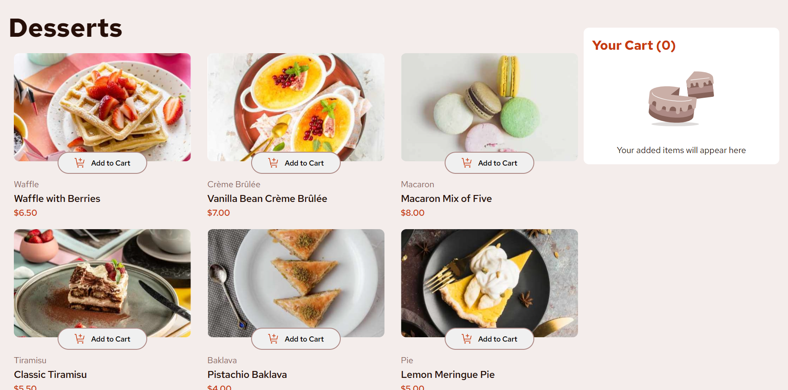

# Frontend Mentor - Product list with cart solution

This is a solution to the [Product list with cart challenge on Frontend Mentor](https://www.frontendmentor.io/challenges/product-list-with-cart-5MmqLVAp_d). Frontend Mentor challenges help you improve your coding skills by building realistic projects. 

## Table of contents

- [Overview](#overview)
  - [The challenge](#the-challenge)
  - [Screenshot](#screenshot)
  - [Links](#links)
- [My process](#my-process)
  - [Built with](#built-with)
  - [What I learned](#what-i-learned)
  - [Continued development](#continued-development)
- [Author](#author)

## Overview

### The challenge

Users should be able to:

- Add items to the cart and remove them
- Increase/decrease the number of items in the cart
- See an order confirmation modal when they click "Confirm Order"
- Reset their selections when they click "Start New Order"
- View the optimal layout for the interface depending on their device's screen size
- See hover and focus states for all interactive elements on the page

### Screenshot

### Links

- Solution URL: [Add solution URL here](https://www.frontendmentor.io/profile/ricardo1003/challenges)
- Live Site URL: [Add live site URL here](https://github.com/ricardo1003/Product-list-with-cart)

## My process

### Built with

- Semantic HTML5 markup
- CSS custom properties
- Flexbox
- CSS Grid
- Mobile-first workflow

### What I learned

I learned many things regarding DOM manipulation here, including creating(and deleting) new elements from JavaScript and manipulating them, adding childs to an element, import and use json files, some tricks with arrays, etc.

### Continued development

Before this I rarely used functions and sometimes repeated code, but after this I realized the importance of them
## Author

- Website - [ricardo1003](https://ricardo1003.github.io/Product-list-with-cart/)
- Frontend Mentor - [@ricardo1003](https://www.frontendmentor.io/profile/ricardo1003)
- Github - [@ricardo1003](https://www.github.com/ricardo1003)
